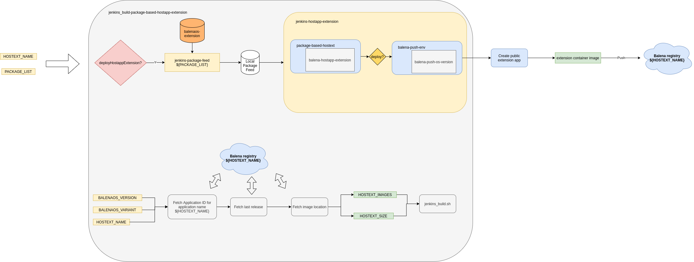

Automation scripts for building default hostapp extensions
==========================================================

Hostapp extensions are built and distributed in two ways:

* As part of a docker-compose file, built on the balenaCloud servers and installed and managed by the supervisor as an app release
* Embedded with a hostOS images

For the second case, the Jenkins automation scripts need to be extended.



Package-based hostapp extensions
================================

Hostapp extensions are basically just container images, and as such they can be built from any source. One common way is to build them using a package feed, and the automation scripts for this type of extensions are described next.

There are two distinct stages:

* Building an deploying the extension to a registry
* Building a target image with a deployed extension

Entry script
------------

__jenkins_build-package-based-hostapp-extension__: This script is the entry point to build extensions from a package feed.

  * __Inputs__:
    * __HOSTEXT_NAME__: The name of the open application where the extension will be deployed. This is typically obtained from the Jenkins job name.
    * __MACHINE__: The device type to build for. This is also typically extracted from the jenkins build job name.
  * __Outputs__: Target images with preloaded extensions and other build artifacts

Building and deploying the hostapp extension
--------------------------------------------


The hostapp extension definition (for example a list of packages for package-based hostapp extensions) is defined in the device type file.

The *jenkins-package-feed* script is called to build the package feed and store it locally on the *deploy-jenkins* folder for other build steps to use. The meta-data used to build the package feed from comes from the _balenaos-extensions_ repository which is part of the device repository. Each extension is defined in a <extension-name>.json file with the following format:

```
{
        "device-types": [],
        "os-versions": [],
        "architectures": [],
        "name": <extension-name>,
        "contents": {
                "packages": [],
                "files": [],
                "kernel-config-fragments": []
        }
}
```

The *jenkins-hostapp-extension*  script will then use the local package feed to build the hostapp extension from a pre-defined Dockerfile. It will optionally deploy to the balena registry creating a public application if needed. This script will use a pre-built device specific container to build the hostapp extension, that will be automatically built and deployed the first time a hostapp extension is built for a specific device type.

Building images with default extensions
---------------------------------------


Given a BalenaOS version and variant, and a hostapp extension application name, the *jenkins_build-package-based-hostapp-extension*script will then query the extension registry and retrieve an image location.

The standard *jenkins_build* script is then called with the image location in __HOSTEXT_IMAGES__, and the extensions size in __PARTITION_SIZE__ to build the target images with a preloaded extension in the data partition.
